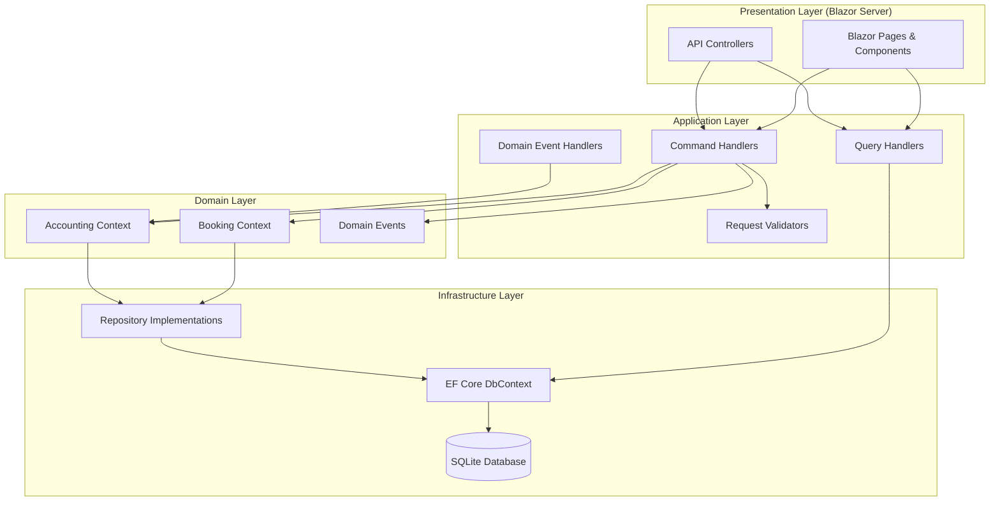
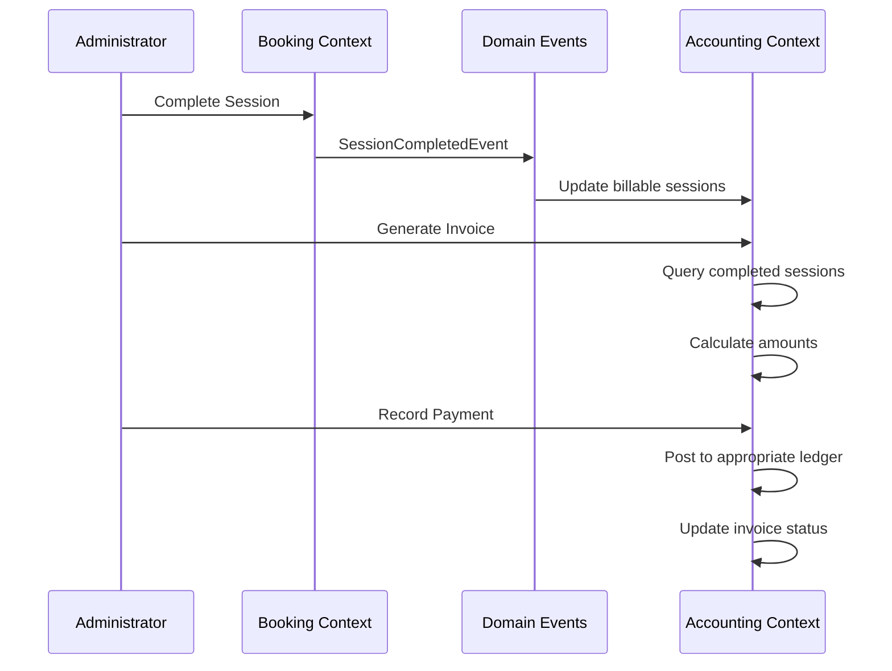
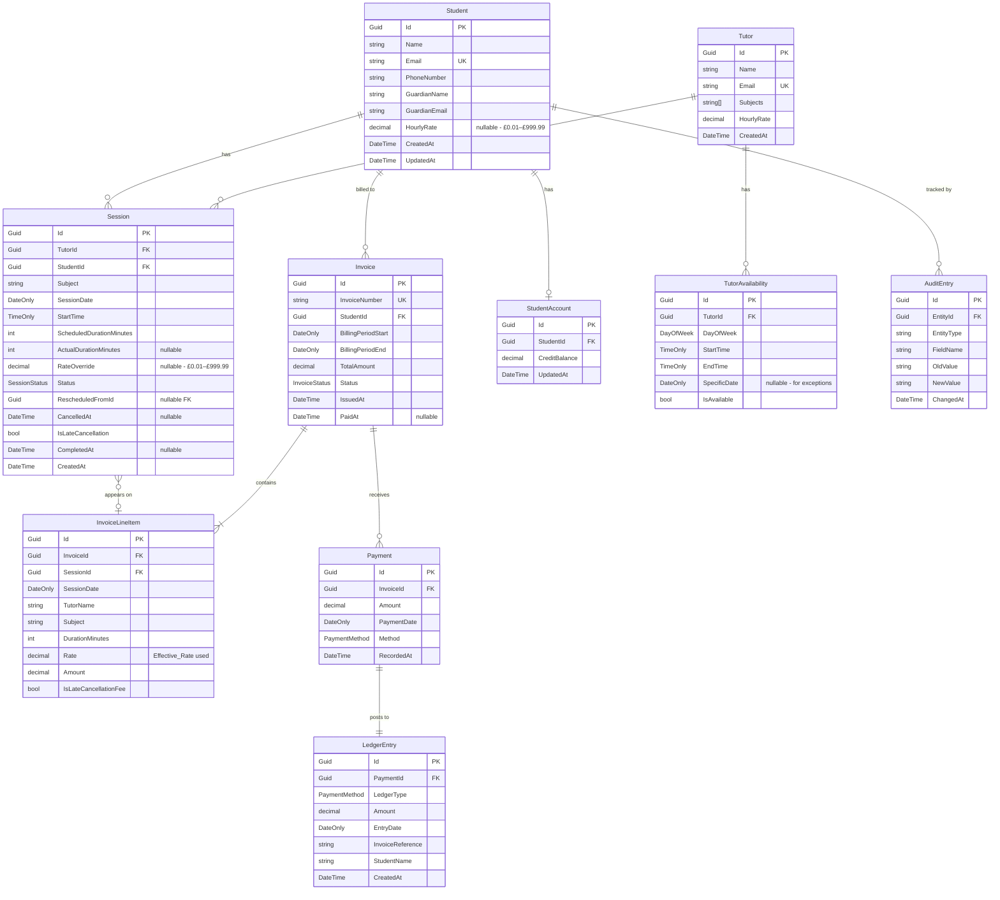

# Design Document: Tutoring Booking System

## Overview

The Tutoring Booking System is a .NET application that integrates session scheduling with financial management for a small tutoring business. It enables administrators to manage students and tutors, book and track sessions, generate invoices, record payments across cash and bank transfer channels, and produce financial reports aligned to the UK tax year.

The system follows Clean Architecture principles, separating domain logic from infrastructure concerns, and uses a layered approach with clearly defined boundaries between the booking subsystem and the accounting subsystem.

### Technology Stack

- **Runtime**: .NET 8 (LTS)
- **Language**: C# 12
- **Architecture**: Clean Architecture with CQRS (Command Query Responsibility Segregation)
- **Database**: SQLite for local deployment (with EF Core for ORM)
- **UI**: Blazor Server (provides calendar view and interactive forms)
- **Testing**: xUnit + FsCheck (property-based testing for .NET)
- **Validation**: FluentValidation
- **Project Type**: ASP.NET Core Web Application

### Key Design Decisions

1. **Clean Architecture** — Decouples business logic from infrastructure, making the domain testable in isolation.
2. **CQRS** — Separates read queries (reports, calendar views) from write commands (bookings, payments), keeping each side optimised for its purpose.
3. **Domain-Driven Design (DDD)** — Rich domain entities with encapsulated business rules, value objects for concepts like Money and DateRange.
4. **SQLite** — Appropriate for a small business with low concurrency; simple deployment without a separate database server.
5. **Blazor Server** — Provides a rich interactive UI without requiring a separate frontend framework; good fit for internal business tools.
6. **Separate Bounded Contexts** — Booking and Accounting are distinct contexts that communicate through domain events.

## Architecture



### Project Structure

```
BatbyEducation/
├── BatbyEducation.sln
├── src/
│   ├── BatbyEducation.Domain/           # Entities, Value Objects, Domain Events, Interfaces
│   ├── BatbyEducation.Application/      # Commands, Queries, Handlers, Validators, DTOs
│   ├── BatbyEducation.Infrastructure/   # EF Core, Repositories, Database Migrations
│   └── BatbyEducation.Web/              # Blazor Server UI, API Controllers, DI Configuration
└── tests/
    ├── BatbyEducation.Domain.Tests/     # Domain unit tests and property tests
    ├── BatbyEducation.Application.Tests/# Application layer tests
    └── BatbyEducation.Integration.Tests/# Integration tests with real database
```

### Bounded Context Communication



## Components and Interfaces

### Domain Layer

#### Booking Context Entities

| Entity | Responsibilities |
|--------|-----------------|
| `Student` | Stores student details, guardian info, contact details, optional hourly rate; enforces email uniqueness |
| `Tutor` | Stores tutor details, subjects, hourly rate; manages availability |
| `TutorAvailability` | Represents recurring weekly slots and one-off exceptions |
| `Session` | Represents a tutoring session with lifecycle (Scheduled → Completed/Cancelled); supports optional rate override |
| `AuditEntry` | Records field-level changes with timestamps |

#### Key Domain Methods

```csharp
// Session factory — accepts optional rate override at booking time
public static Session Create(
    Guid tutorId, Guid studentId, string subject,
    DateOnly sessionDate, TimeOnly startTime, int durationMinutes,
    decimal? rateOverride = null);

// Session rate override — only allowed while Scheduled
public Result SetRateOverride(decimal? rate);
// Returns failure if status != Scheduled or if rate is outside £0.01–£999.99

// Student — optional per-student rate
public Result SetHourlyRate(decimal? rate);
// Returns failure if rate is outside £0.01–£999.99
```

#### Accounting Context Entities

| Entity | Responsibilities |
|--------|-----------------|
| `Invoice` | Represents a bill for sessions within a billing period; manages status lifecycle |
| `InvoiceLineItem` | Individual session charge on an invoice; stores the Effective_Rate used |
| `Payment` | Records a payment against an invoice with method classification |
| `LedgerEntry` | Transaction record in either cash or bank transfer ledger |
| `StudentAccount` | Tracks credits and overall balance per student |

#### Effective_Rate Resolution

When generating invoice line items, the system determines the rate for each session using the following priority chain:

1. **Session_Rate_Override** — if the session has a non-null `RateOverride`, use it
2. **Student_Hourly_Rate** — else if the student has a non-null `HourlyRate`, use it
3. **Tutor HourlyRate** — else fall back to the tutor's configured hourly rate

### Key Interfaces

```csharp
// Domain Layer Interfaces
public interface IStudentRepository
{
    Task<Student?> GetByIdAsync(Guid id);
    Task<Student?> GetByEmailAsync(string email);
    Task<IReadOnlyList<Student>> GetAllAsync();
    Task AddAsync(Student student);
    Task UpdateAsync(Student student);
}

public interface ITutorRepository
{
    Task<Tutor?> GetByIdAsync(Guid id);
    Task<Tutor?> GetByEmailAsync(string email);
    Task<IReadOnlyList<Tutor>> GetAllAsync();
    Task AddAsync(Tutor tutor);
    Task UpdateAsync(Tutor tutor);
}

public interface ISessionRepository
{
    Task<Session?> GetByIdAsync(Guid id);
    Task<IReadOnlyList<Session>> GetByDateRangeAsync(DateOnly start, DateOnly end);
    Task<IReadOnlyList<Session>> GetByTutorAndDateRangeAsync(Guid tutorId, DateOnly start, DateOnly end);
    Task<IReadOnlyList<Session>> GetByStudentAndDateRangeAsync(Guid studentId, DateOnly start, DateOnly end);
    Task<IReadOnlyList<Session>> GetConflictingSessionsAsync(Guid tutorId, DateTime start, DateTime end);
    Task<IReadOnlyList<Session>> GetStudentConflictsAsync(Guid studentId, DateTime start, DateTime end);
    Task AddAsync(Session session);
    Task UpdateAsync(Session session);
}

public interface IInvoiceRepository
{
    Task<Invoice?> GetByIdAsync(Guid id);
    Task<Invoice?> GetByInvoiceNumberAsync(string invoiceNumber);
    Task<IReadOnlyList<Invoice>> GetByStudentAsync(Guid studentId);
    Task<IReadOnlyList<Invoice>> GetOverdueAsync();
    Task<IReadOnlyList<Invoice>> GetByDateRangeAsync(DateOnly start, DateOnly end);
    Task AddAsync(Invoice invoice);
    Task UpdateAsync(Invoice invoice);
}

public interface IPaymentRepository
{
    Task<IReadOnlyList<Payment>> GetByInvoiceAsync(Guid invoiceId);
    Task<IReadOnlyList<Payment>> GetByDateRangeAndMethodAsync(DateOnly start, DateOnly end, PaymentMethod method);
    Task<IReadOnlyList<Payment>> GetByDateRangeAsync(DateOnly start, DateOnly end);
    Task AddAsync(Payment payment);
}

public interface ILedgerRepository
{
    Task<IReadOnlyList<LedgerEntry>> GetEntriesAsync(PaymentMethod method, DateOnly start, DateOnly end);
    Task<decimal> GetTotalAsync(PaymentMethod method, DateOnly start, DateOnly end);
    Task<int> GetTransactionCountAsync(PaymentMethod method, DateOnly start, DateOnly end);
    Task AddAsync(LedgerEntry entry);
}
```

### Application Layer Commands

| Command | Handler Responsibility |
|---------|----------------------|
| `RegisterStudentCommand` | Validates input, checks email uniqueness, creates student with optional hourly rate |
| `UpdateStudentCommand` | Validates input, records audit entry (including rate changes), updates student |
| `RegisterTutorCommand` | Validates input, checks email uniqueness, creates tutor |
| `SetTutorAvailabilityCommand` | Updates availability, flags affected sessions |
| `BookSessionCommand` | Validates availability, checks conflicts, creates session with optional rate override |
| `UpdateSessionRateCommand` | Validates session is Scheduled, validates rate range, sets or clears Session_Rate_Override |
| `CancelSessionCommand` | Validates status, applies cancellation rules, updates session |
| `RescheduleSessionCommand` | Creates new session, links to original, validates availability |
| `CompleteSessionCommand` | Validates status, records actual duration, updates session |
| `GenerateInvoiceCommand` | Queries completed sessions, determines Effective_Rate per line item (Session RateOverride > Student HourlyRate > Tutor HourlyRate), calculates amounts, creates invoice |
| `RecordPaymentCommand` | Validates amount, posts to ledger, updates invoice status |

### Application Layer Queries

| Query | Returns |
|-------|---------|
| `GetCalendarQuery` | Sessions grouped by day for a date range with optional filters |
| `GetOutstandingBalancesQuery` | Per-student balance summaries |
| `GetOverdueInvoicesQuery` | List of overdue invoices sorted by days overdue |
| `GetPaymentNotReceivedQuery` | Sessions flagged for payment follow-up |
| `GetRevenueReportQuery` | Revenue summary for a date range |
| `GetTutorEarningsQuery` | Per-tutor hours and revenue for a date range |
| `GetMonthlySummaryQuery` | Month-by-month breakdown for a tax year |
| `GetTaxYearSummaryQuery` | Complete tax year financial summary |
| `GetLedgerSummaryQuery` | Ledger totals and transaction list for a date range |

## Data Models

### Entity Relationship Diagram



### Enumerations

```csharp
public enum SessionStatus
{
    Scheduled,
    Completed,
    Cancelled,
    PendingConfirmation,
    RequiresRescheduling,
    Rescheduled
}

public enum InvoiceStatus
{
    Issued,
    PartiallyPaid,
    Paid,
    Overdue,
    Cancelled
}

public enum PaymentMethod
{
    Cash,
    BankTransfer
}
```

### Value Objects

```csharp
public record Money(decimal Amount)
{
    public static Money Zero => new(0m);
    public Money Add(Money other) => new(Amount + other.Amount);
    public Money Subtract(Money other) => new(Amount - other.Amount);
    public bool IsPositive => Amount > 0;
    public bool IsZeroOrNegative => Amount <= 0;
}

public record DateRange(DateOnly Start, DateOnly End)
{
    public bool Contains(DateOnly date) => date >= Start && date <= End;
    public static DateRange TaxYear(int startYear) =>
        new(new DateOnly(startYear, 4, 6), new DateOnly(startYear + 1, 4, 5));
    public static DateRange CurrentWeek()
    {
        var today = DateOnly.FromDateTime(DateTime.Today);
        var monday = today.AddDays(-(int)today.DayOfWeek + (int)DayOfWeek.Monday);
        return new(monday, monday.AddDays(6));
    }
}

public record HourlyRate
{
    public const decimal MinRate = 0.01m;
    public const decimal MaxRate = 999.99m;

    public decimal Value { get; }

    public HourlyRate(decimal value)
    {
        if (value < MinRate || value > MaxRate)
            throw new DomainException($"Hourly rate must be between £{MinRate} and £{MaxRate}");
        Value = value;
    }

    public static bool IsValid(decimal value) => value >= MinRate && value <= MaxRate;
}

public record EmailAddress
{
    public string Value { get; }
    public EmailAddress(string value)
    {
        if (!IsValid(value))
            throw new DomainException("Invalid email format");
        Value = value;
    }
    public static bool IsValid(string email) =>
        !string.IsNullOrWhiteSpace(email) &&
        System.Text.RegularExpressions.Regex.IsMatch(email, @"^[^@\s]+@[^@\s]+\.[^@\s]+$");
}
```

### Tax Year Month Boundaries

The UK tax year runs from 6 April to 5 April. Monthly boundaries within the tax year:

| Month | Start | End |
|-------|-------|-----|
| Month 1 | 6 April | 5 May |
| Month 2 | 6 May | 5 June |
| Month 3 | 6 June | 5 July |
| Month 4 | 6 July | 5 August |
| Month 5 | 6 August | 5 September |
| Month 6 | 6 September | 5 October |
| Month 7 | 6 October | 5 November |
| Month 8 | 6 November | 5 December |
| Month 9 | 6 December | 5 January |
| Month 10 | 6 January | 5 February |
| Month 11 | 6 February | 5 March |
| Month 12 | 6 March | 5 April |

## Correctness Properties

*A property is a characteristic or behavior that should hold true across all valid executions of a system — essentially, a formal statement about what the system should do. Properties serve as the bridge between human-readable specifications and machine-verifiable correctness guarantees.*

### Property 1: Entity creation round-trip

*For any* valid student, tutor, or session entity created with valid data, reading back the entity should produce a record with all fields matching the original input and a unique, non-empty identifier assigned by the system.

**Validates: Requirements 1.1, 1.2, 2.1, 2.2, 3.1, 3.4**

### Property 2: Email uniqueness enforcement

*For any* registration (student or tutor) where an entity with the same email address already exists, the system shall reject the registration with an error indicating the email is already in use.

**Validates: Requirements 1.4, 2.6**

### Property 3: Required field validation

*For any* student registration with one or more required fields missing or empty, the system shall reject the registration and the error shall reference exactly the fields that are missing.

**Validates: Requirements 1.5**

### Property 4: Email format validation

*For any* string that does not conform to a valid email format (missing @, missing domain, etc.), submitting it as an email address in a registration shall be rejected with an email format error.

**Validates: Requirements 1.6**

### Property 5: Audit trail on entity update

*For any* student field update, the system shall create an audit entry containing the field name, previous value, new value, and a timestamp, such that the audit history fully records the change.

**Validates: Requirements 1.3**

### Property 6: Tutor availability round-trip

*For any* valid availability configuration (day of week, start time, end time with duration ≥ 30 minutes), storing and retrieving the availability should produce equivalent data.

**Validates: Requirements 2.3**

### Property 7: Booking respects tutor availability and conflicts

*For any* session booking request, the booking shall succeed only if the entire session window (start time through start time + duration) falls within the tutor's configured availability AND the tutor has no existing session overlapping that window AND the student has no existing session overlapping that window. Otherwise the booking shall be rejected with the specific conflict indicated.

**Validates: Requirements 3.2, 3.3, 3.5, 3.7**

### Property 8: Subject validation on booking

*For any* booking request where the specified subject is not in the tutor's configured subjects list, the system shall reject the booking and display the tutor's available subjects.

**Validates: Requirements 3.6**

### Property 9: Cancellation state machine

*For any* session, cancellation shall succeed only if the session status is "Scheduled". For sessions in any other status, cancellation shall be rejected. A successful cancellation shall set status to "Cancelled" and record the cancellation timestamp while preserving all original session data.

**Validates: Requirements 4.1, 4.5**

### Property 10: Late cancellation classification

*For any* cancellation where the time between the cancellation timestamp and the session start time is less than 24 hours, the session shall be marked as a late cancellation (IsLateCancellation = true). For cancellations 24+ hours before session start, IsLateCancellation shall be false.

**Validates: Requirements 4.2**

### Property 11: Reschedule creates linked session

*For any* rescheduled session, the system shall create a new session with a reference to the original session ID, and the original session's status shall be set to "Rescheduled". The new session must pass the same availability and conflict checks as a fresh booking.

**Validates: Requirements 4.3, 4.4**

### Property 12: Session completion state machine

*For any* session, marking as completed shall succeed only if the session is in "Scheduled" or "PendingConfirmation" status. Completion shall set status to "Completed" and record a completion timestamp. Sessions in "Cancelled" or "Rescheduled" status shall be rejected for completion.

**Validates: Requirements 5.1, 5.4**

### Property 13: Actual duration validation on completion

*For any* actual duration value provided during session completion, the system shall accept it only if it falls within [15, 240] minutes. Values outside this range shall be rejected.

**Validates: Requirements 5.3, 5.5**

### Property 14: Invoice includes exactly the correct sessions

*For any* student and billing period (start date, end date), the generated invoice shall include as line items exactly those sessions with status "Completed" or "Late Cancellation" whose session date falls within the billing period (inclusive). No other sessions shall be included.

**Validates: Requirements 6.1**

### Property 15: Invoice line item calculation uses Effective_Rate

*For any* completed session with actual duration D minutes and Effective_Rate R (determined by the priority chain: Session RateOverride if set, else Student HourlyRate if set, else Tutor HourlyRate), the invoice line item amount shall equal (D / 60) × R. For late-cancelled sessions, the line item amount shall equal the configured late cancellation fee regardless of duration or rate.

**Validates: Requirements 6.2, 6.3, 6.5**

### Property 16: Invoice status reflects payment totals

*For any* invoice, the status shall be "Paid" when total payments ≥ invoice amount, "Partially Paid" when total payments > 0 but < invoice amount, and "Issued" when no payments have been recorded. The remaining balance shall equal invoice amount minus total payments.

**Validates: Requirements 7.5, 7.6**

### Property 17: Overpayment creates student credit

*For any* payment whose amount exceeds the outstanding balance on an invoice, the excess (payment amount - outstanding balance) shall be added to the student's account credit balance.

**Validates: Requirements 7.7**

### Property 18: Payment validation constraints

*For any* payment with amount ≤ 0, the system shall reject it. For any payment against an invoice with status "Paid" or "Cancelled", the system shall reject it.

**Validates: Requirements 7.8, 7.9**

### Property 19: Ledger posting correctness

*For any* payment recorded, a corresponding ledger entry shall exist in exactly one ledger (Cash Ledger for cash payments, Bank Transfer Ledger for bank transfers) with matching amount, date, invoice reference, and student name. No payment shall appear in both ledgers.

**Validates: Requirements 8.1, 8.2, 8.3**

### Property 20: Ledger summary calculation

*For any* ledger and date range, the summary total shall equal the sum of all entry amounts within that range, the transaction count shall match the number of entries, and entries shall be in chronological order.

**Validates: Requirements 8.4**

### Property 21: Outstanding balance calculation

*For any* student, the outstanding balance shall equal the sum of amounts on invoices with status "Issued" or "Partially Paid" (subtracting payments already made on partially paid invoices) minus any account credit balance.

**Validates: Requirements 9.1**

### Property 22: Overdue invoice detection

*For any* invoice with status "Issued" or "Partially Paid" where the current date is more than 30 days past the issue date, the invoice shall be flagged as "Overdue".

**Validates: Requirements 9.2**

### Property 23: Bank transfer payment deadline enforcement

*For any* session requiring bank transfer payment, if payment has not been received at least 24 hours before the session start time, the session shall be flagged as "Payment Not Received". If payment is subsequently received in full, the flag shall be removed.

**Validates: Requirements 7.3, 7.4, 10.3**

### Property 24: Revenue report consistency

*For any* date range, total payments received shall equal cash receipts + bank transfer receipts, and each component shall match the respective ledger total for that same date range.

**Validates: Requirements 11.1, 11.4**

### Property 25: Tax year monthly breakdown sums to total

*For any* tax year, the month-by-month breakdown shall contain exactly 12 entries (with correct 6th-to-5th boundaries), and the sum of all monthly values shall equal the tax year total.

**Validates: Requirements 11.3, 12.5**

### Property 26: Tax year income calculation

*For any* tax year (start year Y), total income shall equal the sum of all payments with payment date in [6 April Y, 5 April Y+1], and shall equal Cash Ledger total + Bank Transfer Ledger total for that period.

**Validates: Requirements 12.1, 12.2**

### Property 27: Calendar filtering correctness

*For any* filter (by tutor or by student) applied to a calendar view for a date range, the displayed sessions shall include exactly those sessions matching both the date range and the filter criteria. No matching sessions shall be omitted and no non-matching sessions shall be included.

**Validates: Requirements 13.2, 13.3, 13.4**

### Property 28: Session rate override state machine

*For any* session in "Scheduled" status, setting or changing the Session_Rate_Override (with a valid value in £0.01–£999.99 or null to clear) shall succeed. For any session not in "Scheduled" status, attempting to set or change the rate override shall be rejected.

**Validates: Requirements 3.8, 3.9**

### Property 29: Effective_Rate priority chain

*For any* completed session on an invoice, the Effective_Rate used for the line item shall equal the Session_Rate_Override if it is set; otherwise the Student_Hourly_Rate if it is set; otherwise the Tutor HourlyRate. No other value shall be used.

**Validates: Requirements 6.2, 6.3**

### Property 30: Hourly rate range validation

*For any* hourly rate value submitted (for Student_Hourly_Rate, Session_Rate_Override, or Tutor HourlyRate), the system shall accept it only if it falls within [£0.01, £999.99]. Values outside this range shall be rejected.

**Validates: Requirements 1.9, 3.10**

## Error Handling

### Validation Errors

All validation errors follow a consistent pattern using a `Result<T>` type:

```csharp
public class Result<T>
{
    public bool IsSuccess { get; }
    public T? Value { get; }
    public IReadOnlyList<ValidationError> Errors { get; }
}

public record ValidationError(string Field, string Message);
```

### Error Categories

| Category | HTTP Status | Handling Strategy |
|----------|-------------|-------------------|
| Validation Errors (missing fields, invalid format) | 400 Bad Request | Return field-level error messages |
| Business Rule Violations (conflicts, invalid state) | 409 Conflict / 422 Unprocessable | Return contextual error with conflict details |
| Not Found (entity doesn't exist) | 404 Not Found | Return entity type and identifier |
| Concurrency Conflicts | 409 Conflict | Retry with fresh data |

### Domain Exceptions

```csharp
public class DomainException : Exception
{
    public string Code { get; }
    public DomainException(string message, string code = "DOMAIN_ERROR") : base(message)
    {
        Code = code;
    }
}

public class BookingConflictException : DomainException
{
    public DateTime ConflictStart { get; }
    public DateTime ConflictEnd { get; }
    public BookingConflictException(DateTime start, DateTime end)
        : base($"Conflicting session exists from {start} to {end}", "BOOKING_CONFLICT")
    {
        ConflictStart = start;
        ConflictEnd = end;
    }
}

public class InvalidStateTransitionException : DomainException
{
    public string CurrentStatus { get; }
    public string AttemptedAction { get; }
    public InvalidStateTransitionException(string status, string action)
        : base($"Cannot {action} a session with status '{status}'", "INVALID_STATE")
    {
        CurrentStatus = status;
        AttemptedAction = action;
    }
}
```

### Error Recovery

- **Database failures**: EF Core handles transactional rollback. Commands that span multiple operations use explicit transactions.
- **Concurrent modifications**: EF Core's optimistic concurrency with row version tokens prevents lost updates.
- **Invalid input**: All commands are validated before execution using FluentValidation. Invalid requests never reach the domain layer.

## Testing Strategy

### Dual Testing Approach

The system uses both unit tests and property-based tests for comprehensive coverage:

- **Unit tests (xUnit)**: Verify specific examples, edge cases, integration points, and error conditions
- **Property-based tests (FsCheck with xUnit)**: Verify universal properties across randomised inputs

### Property-Based Testing Configuration

- **Library**: FsCheck 2.x with FsCheck.Xunit integration
- **Minimum iterations**: 100 per property test
- **Tag format**: `Feature: tutoring-booking-system, Property {number}: {property_text}`
- Each correctness property from the design maps to exactly one property-based test

### Test Layers

| Layer | Framework | Focus |
|-------|-----------|-------|
| Domain Unit Tests | xUnit | Entity behaviour, value object validation, state transitions |
| Domain Property Tests | FsCheck + xUnit | Universal properties across randomised inputs |
| Application Tests | xUnit + Moq | Command/query handlers with mocked repositories |
| Integration Tests | xUnit + EF Core InMemory/SQLite | Full stack through real database |

### Custom Generators (FsCheck)

The property tests will use custom FsCheck `Arbitrary<T>` generators for:

- `Student` — valid names (1-100 chars), valid emails, phone numbers, guardian info, optional hourly rate (null or 0.01-999.99)
- `Tutor` — valid names, emails, subjects (1-20), hourly rates (0.01-999.99)
- `Session` — valid dates, times, durations (15-240 min), valid statuses, optional rate override (null or 0.01-999.99)
- `Invoice` — valid billing periods, line items with correct Effective_Rate calculations
- `Payment` — valid amounts (≥ 0.01), valid methods, valid dates
- `DateRange` — valid start ≤ end, including tax year boundaries
- `TaxYear` — valid start years generating correct 6 April - 5 April ranges
- `HourlyRate` — valid decimal values in range 0.01-999.99

### Test Organisation

```
tests/
├── BatbyEducation.Domain.Tests/
│   ├── Properties/           # Property-based tests (1 file per property group)
│   │   ├── EntityCreationProperties.cs
│   │   ├── BookingProperties.cs
│   │   ├── SessionLifecycleProperties.cs
│   │   ├── RateProperties.cs
│   │   ├── InvoiceProperties.cs
│   │   ├── PaymentProperties.cs
│   │   ├── LedgerProperties.cs
│   │   ├── BalanceProperties.cs
│   │   ├── ReportProperties.cs
│   │   └── CalendarProperties.cs
│   ├── Generators/           # FsCheck Arbitrary<T> implementations
│   │   └── DomainGenerators.cs
│   ├── Entities/             # Unit tests for entity behaviour
│   └── ValueObjects/         # Unit tests for value objects
├── BatbyEducation.Application.Tests/
│   ├── Commands/             # Command handler tests
│   └── Queries/              # Query handler tests
└── BatbyEducation.Integration.Tests/
    ├── Repositories/         # Repository integration tests
    └── Workflows/            # End-to-end workflow tests
```

### Key Unit Test Scenarios (Examples and Edge Cases)

- **6.6**: Invoice generation with no billable sessions returns appropriate message
- **8.5**: Ledger summary with no transactions shows zero totals
- **12.6**: Tax year summary with no records shows all zeros
- **13.1**: Calendar defaults to current week Monday-Sunday
- **13.5**: Status colour mapping (Scheduled=blue, Completed=green, etc.)
- **13.6**: Empty calendar displays appropriate message

